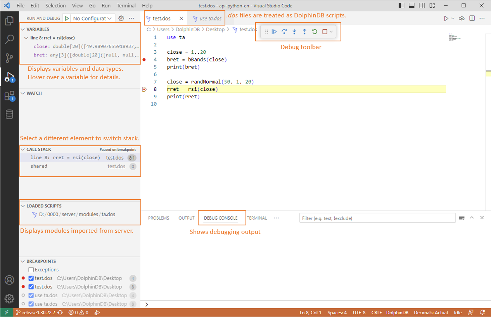

# Debugging DolphinDB Scripts with DolphinDB Extension for Visual Studio Code

- [Debugging DolphinDB Scripts with DolphinDB Extension for Visual Studio Code](#debugging-dolphindb-scripts-with-dolphindb-extension-for-visual-studio-code)
  - [1. Introduction](#1-introduction)
  - [2. Overview](#2-overview)
  - [3. Getting Started](#3-getting-started)
    - [3.1 Writing Script](#31-writing-script)
    - [3.2 Setting Breakpoints](#32-setting-breakpoints)
    - [3.3 Starting Debugging](#33-starting-debugging)
    - [3.4 Debugging Actions](#34-debugging-actions)
  - [4. Advanced Features](#4-advanced-features)
    - [4.1 Syntax Parsing](#41-syntax-parsing)
    - [4.2 Breakpoint Management](#42-breakpoint-management)
    - [4.3 Multi-Target Debugging](#43-multi-target-debugging)
    - [4.4 Currently Unsupported Features](#44-currently-unsupported-features)
  - [5. Conclusion](#5-conclusion)


## 1. Introduction

This tutorial introduces how to debug DolphinDB scripts using the DolphinDB extension for Visual Studio Code (VS Code). The debug feature allows you to track script execution, inspect variables and call stack, and more.

To use this feature, the version of your DolphinDB server must be 1.30.22.1/2.00.10.1 or higher.

## 2. Overview

The debugging architecture consists of several components working together:


| **Component**                   | **Description**                                                                                                     |
| ------------------------------- | ------------------------------------------------------------------------------------------------------------------- |
| Debug Server (DolphinDB Server) | The database process that handles interrupts, hangs, and queries.                                                   |
| Debug Adapter                   | An intermediary component which handles communication between VS Code extension and the DolphinDB server using DAP. |
| Debug Adapter Protocol (DAP)    | An abstract communication protocol defined by Microsoft.                                                            |
| Debug Client                    | The user interface for debugging within VS Code. See screenshot below.                                              |




## 3. Getting Started

Follow the steps below to start debugging with the DolphinDB extension.

**Note: The version of your DolphinDB server must be 1.30.22.1/2.00.10.1 or higher.**

### 3.1 Writing Script

For readability and convenience, it is a best practice to write only one statement per line in DolphinDB scripts. The following script will be used as an example in this tutorial:

```
use ta

close = 1..20
bret = bBands(close)
print(bret)

close = randNormal(50, 1, 20)
rret = rsi(close)
print(rret)
```

### 3.2 Setting Breakpoints

To set a break point, navigate to the desired line and left-click on the editor margin. 

  

In this example, we set breakpoints on line 4 and line 8. This will insert red dots to mark those lines as breakpoints.


### 3.3 Starting Debugging

1. Click the “EXPLORER” icon -> **DOLPHINDB** tab, select a DolphinDB server for debugging.

 

2. In the Status Bar, make sure that “DolphinDB“ is selected as the scripting language.

 

3. Launch the debug session by clicking the “Run and Debug” icon on the navigation sidebar and clicking **Run and Debug**. Alternatively, press the F5 key.


The user interface is displayed as follows once the debug session starts: 


In the editor view, the line to be executed next is highlighted in yellow. 

The **DEBUG CONSOLE** will display debugging output and exception information. If the debugging session fails to start, check the error message in the **DEBUG CONSOLE**.

One possible reason is that the version of your DolphinDB server is outdated. In this case, the following error is reported: `socket hang up Debug server connection failed, please make sure DolphinDB Server version is not lower than 2.00.10.1 or 1.30.22.1`

#### Example of debug configuration file launch.json
```json
{
    "version": "0.2.0",
    "configurations": [
        {
            "name": "Debug Current DolphinDB Script File",
            "type": "dolphindb",
            "request": "launch",
            "program": "${file}"
        },
    ]
}
```

### 3.4 Debugging Actions

Once a debug session begins, a toolbar appears on the top of the editor. The following debugging actions are available: Continue, Step Over, Step Into, Step Out, Restart and Stop.

 

#### 3.4.1 Step Over (`F10`)

When the debug session is first launched, line 4 is highlighted (see the previous screenshot) because it is the next line to be executed. Press F10 to allow the server to execute line 4. The highlight will then move down to line 5, indicating it is the next line to run.


#### 3.4.2 Continue (`F5`)

Executing the script line-by-line can be time-consuming. Typically, we only want to inspect the execution at lines where breakpoints are set.

Press F5 to allow the server to run the script until it reaches the next breakpoint (line 8 in this example). The highlight will then move down to line 8.


#### 3.4.3 Variable Inspection

The **VARIABLES** view is displayed in the **RUN AND DEBUG** view:

  

In this example, hover over the "close" and "bret" variables in the VARIABLES view to see their full values. 

  

#### 3.4.4 Step Into (`F11`)

This action allows the server to enter the next function and follow its execution line-by-line. 

In this example, we have executed up to line 8 where the `rsi` function is called.

Press F11 to allow the server to step into `rsi`. The highlight will move inside the function. As shown in the screenshot below, the highlight indicates that the first line is to be executed next.


#### 3.4.5 Call Stack Inspection

The **CALL STACK** view is displayed in the **RUN AND DEBUG** view:


You can click on an entry to switch between functions. The **VARIABLES** view will display the variables for the currently selected function.

#### 3.4.6 Dynamically Toggling Breakpoints

During script execution, we can dynamically update breakpoints. For example, we can add two new breakpoints at lines 152 and 153, as shown in the screenshot. Red dots will appear in the left margin of the editor, indicating that the new breakpoints have been successfully added.


We can also remove breakpoints during execution. For example, clicking in the left margin next to line 152 will delete the breakpoint on that line. As shown in the screenshot, the red dot next to line 152 disappears, indicating the breakpoint has been successfully removed.


#### 3.4.7 Step Out (`Shift`+`F11`)

When inside a function, click the “Step Out“ icon in the toolbar to complete remaining lines of the current function and return to the earlier execution context.

For example, the following screenshot shows that after completing execution of the `rsi` function on line 8, we have stepped back out to line 9 in the main script.


#### 3.4.8 Restart and Stop (`Shift`+`F5`)

To stop the current script execution and start debugging again, click the “Restart“ icon in the toolbar.

To terminate the current execution, click the “Stop“ icon in the toolbar.

## 4. Advanced Features

### 4.1 Syntax Parsing

Before debugging starts, the DolphinDB server performs an initial syntax check on the script. If any syntax errors are detected, debugging will not begin and an error message will be printed in the **DEBUG CONSOLE**.


### 4.2 Breakpoint Management

In the **RUN and DEBUG** view’s **BREAKPOINTS** section, you can view the details of each breakpoint, including its status, the script name, script directory, and line location. 

To disable all breakpoints, click the “Toggle Activate Breakpoints“ icon  in the upper-right corner. Click the icon again or add a new breakpoint to enable them.

To remove all breakpoints (including disabled ones), click the “Remove All Breakpoints“ icon in the upper-right corner.


### 4.3 Multi-Target Debugging

After you’ve started a debug session, just launch another session, and the VS Code will switch to multi-target mode. With the multi-target mode:

- Each session shows up as top-level element in the **CALL STACK** view.
- The debug toolbar shows the currently active session. The other sessions are available in the dropdown menu.


- Debug actions are performed on the active session. To change the active session, using the dropdown menu in the debug toolbar, or switch to a different element in the **CALL STACK** view.


### 4.4 Currently Unsupported Features

#### 4.4.1 Syntax

- Function views - While function views pass the initial syntax check, they will raise error once debugging begins;
- `include` statements - The error “Does not support Debug mode when using include“ will be raised. Please consider using the `use` statement as an alternative.
- Multithreading or remote procedure call functions like `submitJob` and `remoteRun` cannot be tracked in the **CALL STACK** view.
- Anonymous functions, lambda expressions and closure are not supported for debugging.

#### 4.4.2 Debugging

- Inline breakpoints, conditional breakpoints, logpoints, watchpoints
- Viewing large variables


## 5. Conclusion

This tutorial covers debugging DolphinDB scripts with the DolphinDB extension for VS Code. It outlines how to set breakpoints, control execution, and inspect data during debugging to efficiently develop scripts. We plan to further improve and expand debugging capabilities to meet additional user needs going forward.