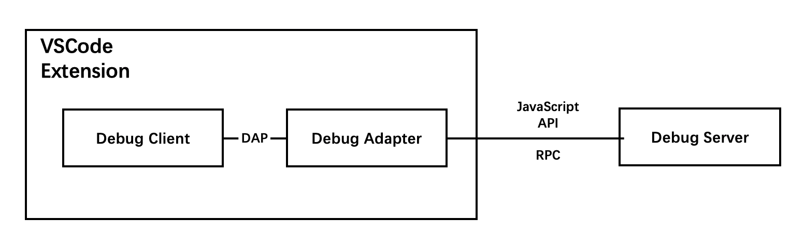
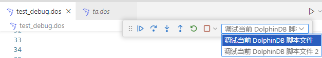

# 使用VSCode插件调试脚本

## 1. 概述
DolphinDB 的 VSCode 插件提供针对用户脚本的调试功能，该功能满足实时追踪运行脚本、显示中间变量的值以及展示函数调用栈信息的用户需求，以利于用户写出更快更好的脚本。下面简单介绍一下该功能的几个组件。



* DolphinDB Server
  
  真正执行中断、挂起、数据查询操作的数据库进程

* Debug Adapter
  
  处理两侧的交互信息

* DAP

  Debug Adapter Protocol，由Microsoft提出的一种通用的Debug信息交互协议。

* Debug Client
  
  VSCode 调试界面，主要负责与用户交互。下图是该界面的主要部件及功能概览。
  

## 2. 开始使用

请运行 DolphinDB Server 并检查版本不低于 2.00.10 或 1.30.22，并按照下面的步骤进行调试

### 2.1 编写脚本
  
  为书写便利，接下来的教程以这段脚本为例。请注意，虽然 DolphinDB 支持一行多条语句，但是出于调试目的以及代码可读性，我们建议每行只写一条语句。
  
  ```dos
  use ta

  close = 1..20
  bret = bBands(close)
  print(bret)

  close = randNormal(50, 1, 20)
  rret = rsi(close)
  print(rret)
  ```

### 2.2 设置断点
  
  在选定行左侧空白处单击鼠标左键, 来设置断点。

  
  
  为了接下来的调试演示，我们在第 4 行和第 8 行分别设置了断点，设置完断点后，编辑器区的左侧空白区域处会出现红色的圆点，表示断点已经设置成功。

  
  
### 2.3 启动调试
  
  查看左下角的连接管理面板，选中调试需要连接的服务器。

  
  
  查看底部状态栏，选择语言模式为 DolphinDB。

  

  按下F5或者点击主侧边栏的运行和调试打开主边栏，再点击名为运行和调试的蓝色按钮。
  
  

  启动后的界面如下图所示，调试界面的左侧是调试信息区，右侧是编辑器区，下方是调试控制台。调试信息区展示变量的值、函数调用栈等信息；编辑器区用黄色的背景标出了将要执行的行；调试控制台用于显示输出信息和异常信息。

  

  如果调试过程无法启动，请打开底部的调试控制台，检查错误信息
  
  可能的原因有:
  - DolphinDB Server 版本太低: 会报错 `Server sent no subprotocol 调试服务器连接失败，请确保 DolphinDB Server 版本不低于 2.00.10 或 1.30.22`

### 2.4 调试过程
  启动调试后，VSCode 的界面上方会出现如下图所示的调试工具栏。从左到右的名称及对应的键盘快捷键分别为继续（F5）、逐过程（F10）、单步调试（F11）、单步跳出（Shift + F11）、重启（Ctrl + Shift + F5）和停止（Shift + F5）。其中继续、逐过程和单步调试是调试中最常用的三个功能，推荐使用快捷键来操作。

  


#### 2.4.1 逐过程（F10）

在上个调试界面中，黄色的背景标出了即将被 Server 执行的第 4 行代码所对应的语句。我们按下 F10，让 Server 程序执行完第 4 行代码。此时的调试界面如下图所示，黄色的背景变成了第 5 行代码所对应的语句。

  

#### 2.4.2 继续（F5）
我们可以利用逐过程的方式一条语句一条语句地执行脚本，但是这样做的效率较低。

通常来说我们比较关心断点所在的语句。在这里，我们关心的是第 8 行代码所对应的语句，按下 F5 后，Server 程序会一直执行到第 8 行代码。此时的调试界面如下图所示，黄色的背景变成了第 8 行代码所对应的语句。
  
  


#### 2.4.3 查看变量
在调试界面的左侧，即调试主边栏中，我们可以在略上方的位置看到变量的值，如下图所示。

  

在这里，`close` 和 `bret` 这两个变量因为过长而导致显示不全，我们可以将光标悬浮在变量的值上方，即可看到完整的值。

  

#### 2.4.4 单步调试（F11）
单步调试用于进入函数内部，查看函数内部的执行情况。在上一步，我们运行到了第8行代码，即 `rsi` 函数的调用语句。

按下 F11 后，Server程序会进入 `rsi` 内。此时对应的调试界面如下图所示，黄色的背景标示程序已经运行到该函数内部，且即将执行第一条语句。

  

#### 2.4.5 查看调用栈
我们将目光再次移动到调试主边栏中。在略下方的位置，可以看到当前的函数调用栈，如下图所示。单击调用栈的某一行，就能在上游函数和下游函数之间切换。此时，调试主边栏上方的变量部分也会显示该层函数所对应的变量的值。


#### 2.4.6 动态更新断点
在脚本执行的过程中，我们可以动态地更新断点。例如，我们可以在 152 行和 153 行的位置新增两个断点，如下图所示，编辑器区的左侧空白区域处会出现两个红色的圆点，表示断点已经新增成功。


当然，我们也可以取消断点。例如，我们单击 152 行左侧空白处来删除 152 行对应的断点。如下图所示，编辑器区左侧空白区域处 152 行对应的红色圆点消失，表示 152 行处的断点已经取消成功。


#### 2.4.7 跳出函数
实际过程中，我们经常需要执行完这个函数并返回上层函数。例如，我们点击调试工具栏中的单步跳出按钮，即可执行完当前函数体的所有内容并返回到上一层函数。此时，如下图所示，我们已经返回到`test.dos`中的第9行代码所对应的语句，代表执行完第8行对应的 `rsi` 函数。


#### 2.4.8 重启以及停止
重启和停止按钮的功能与其名字相符。例如，我们点击调试工具栏中的重启按钮，即可重启调试；相应地，点击停止按钮，即可停止调试。


## 3. 进阶指南
### 3.1 语法解析
调试开始时, DolphinDB 会对代码进行初步检测, 如果代码有语法错误, 不会进入调试状态, 并且调试控制台会输出错误信息。


### 3.2 断点管理
  如下图所示，在调试主边栏的下方，可以看到所有断点的信息，包括断点的状态、断点的文件名和文件路径以及行号。值得注意的是右上方有两个按钮，禁用所有断点以及删除所有断点。
  
  点击禁用所有断点可以暂时关闭所有断点，恢复正常程序的执行；再次点击此按钮或者手动添加新断点时，会自动开启所有断点。

  点击删除所有断点可以删除所有断点，包括已经禁用的断点。

  

### 3.3 多目标调试
  使用多目标调试很简单：在启动一个调试会话的同时, 只需启动另一个调试会话，VSCode 将自动切换到多目标模式：

- 各个会话现在在“调用堆栈”视图中显示为顶级元素

  
- 调试工具栏显示当前活动的会话（所有其他会话在下拉菜单中可用）

  
- 调试操作（例如, 调试工具栏中的所有操作）在活动会话上执行可以使用调试工具栏中的下拉菜单或在“调用堆栈”视图中选择其他元素来更改活动会话

### 3.4 暂不支持的调试功能与脚本语法

#### 3.4.1 不支持的脚本语法

* functionview 会通过初步的语法检查, 但使用此类语法会导致 DolphinDB 宕机。

* 含有 include 语句的脚本调试会报错“Does not support Debug mode when using include”。可以考虑用 use 替代。

* submitJob, remoteRun 等远程调用类函数不能跟踪函数栈调用

* 匿名函数、lambda 表达式、闭包

#### 3.4.2 不支持的调试功能

* 内联断点、条件断点、记录点、监视
  
* 查看长度较大的变量


* 调试控制台查询表达式的值
