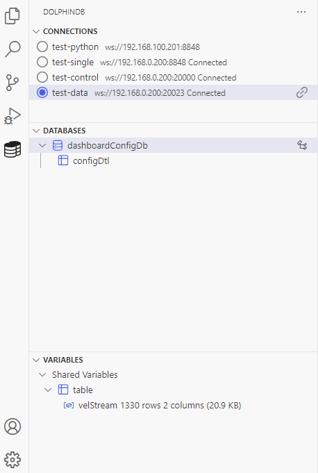
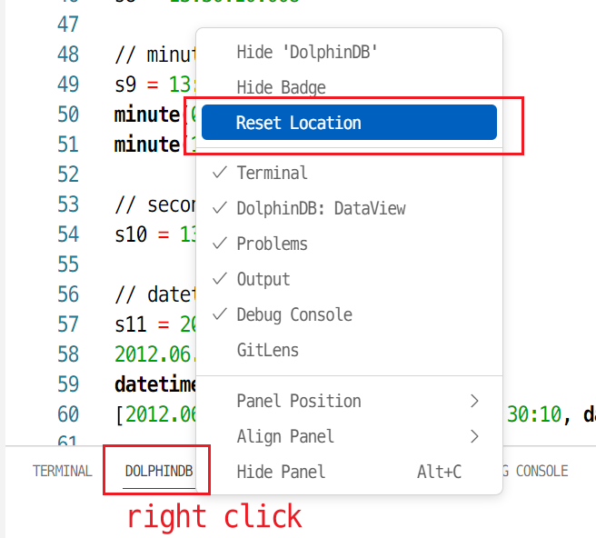
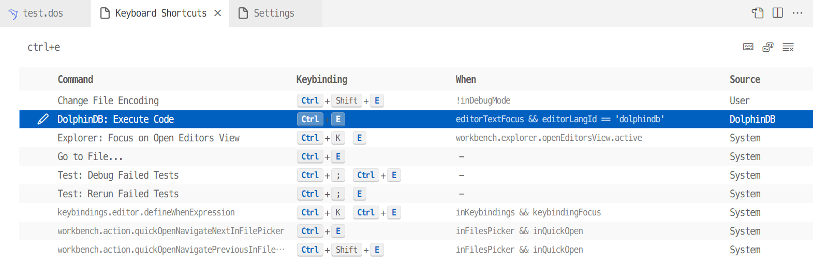

# DolphinDB VSCode Extension

<p align='center'>
    
</p>

<p align='center'>
    <a href='https://marketplace.visualstudio.com/items?itemName=dolphindb.dolphindb-vscode' target='_blank'>
        
    </a>
    <a href='https://marketplace.visualstudio.com/items?itemName=dolphindb.dolphindb-vscode' target='_blank'>
        
    </a>
    <a href='https://github.com/dolphindb/api-javascript' target='_blank'>
        
    </a>
</p>

## English | [中文](./README.zh.md)

VSCode is a lightweight, high-performance and highly extensible code editor developed by Microsoft. It provides a powerful plugin framework, developers can extend the functionality of the VSCode editor by writing extensions, and even support new programming languages.

DolphinDB has developed this VSCode extension for the DolphinDB database, adding support for the self-developed DolphinDB scripting language in VSCode, allowing users to write and execute scripts to operate the database or view the data in the database.

## Features
- Code highlighting
- Code completion for keywords, constants, built-in functions
- Documentation hints, parameter hints for built-in functions
- The terminal can display the results of code execution and the messages output by the print function
- Display the execution status in the bottom bar, click to cancel the job
- Display data structures such as tables, vectors, matrices, etc. in tabular form in the bottom panel
- Manage multiple database connections in the side panel, showing session variables
- Display table in browser popup


## Getting Started
#### 1. Install or upgrade VSCode to the latest version (above v1.68.0)
https://code.visualstudio.com/


#### 2. Install this extension
Search for dolphindb in the VSCode plugin panel, click install

If the installation fails due to network reasons, you can go to the page below to manually download the plugin with the suffix `.vsix`, and drag it to the VSCode plugin panel after downloading.  
https://marketplace.visualstudio.com/items?itemName=dolphindb.dolphindb-vscode

Click on Version History to download the latest version locally

After installing the plugin, please completely quit all windows of VSCode and reopen VSCode, otherwise you may not be able to view the variables in the browser (see below)

#### 3. View and edit server connection configuration
##### Connections can be viewed in the DolphinDB area of the EXPLORER panel on the left side of the VSCode editor
After the plug-in is successfully installed, the following DOLPHINDB connection management area will be added in the Explorer (EXPLORER) panel



##### Edit connections
Click the `settings` button in the upper right corner, and then jump to the `settings.json` configuration file to edit the `dolphindb.connections` configuration item  
`dolphindb.connections` configuration item is an object array, there are four connection configurations by default, you can modify or add connection objects according to the situation,  
The `name` and `url` attributes are required (different connection objects must have different `name`), and the default is to automatically log in to the admin account ("autologin": true)  
Move the mouse over the attribute to view the description of the corresponding attribute


#### 4. Open or create a DolphinDB script file
- If the script file name is suffixed with `.dos` (short for DolphinDB Script), the plugin will automatically recognize the DolphinDB language, and automatically enable syntax highlighting, code completion, and prompts
- If the script file name is not `.dos` suffix, such as `.txt` suffix, you need to manually associate the DolphinDB language, the method is as follows:

Click the language selection button in the status bar in the lower right corner of the VSCode editor, as shown below  

Enter `dolphindb` in the language selection pop-up box and press Enter to switch the language associated with the current file to the DolphinDB language  


#### 5. Press the shortcut key `Ctrl + E` to execute the code
In the opened DolphinDB script file, you can press the shortcut key `Ctrl + E` to send the code to the DolphinDB Server for execution. When the code is executed for the first time, it will automatically connect to the selected connection in the DOLPhinDB area
- If there is currently selected code, the selected code will be sent to DolphinDB Server for execution
- If there is no currently selected code, the line where the current cursor is will be sent to DolphinDB Server for execution

After the code is executed, there will be text-based output in the terminal below the VSCode editor. If the last statement of the executed code returns a table, array, or matrix, it will automatically switch to the DolphinDB area of the panel below the VSCode editor. Forms to display data structures such as tables, vectors, and matrices. It is recommended to drag the contents of the DolphinDB tab to the right side of the terminal, as shown in the figure below


##### FAQ

- If there is an error like `Webview fatal error: Error: Could not register service workers: InvalidStateError: Failed to register a ServiceWorker: The document is in an invalid state..`, please restart VSCode

- If there is no automatic switch to the DolphinDB view at the bottom after executing the code and returning to the form, you need to reset the position of the DolphinDB view, as shown in the figure below


- If there is no response to the `Ctrl + E` shortcut key, it may be that the DolphinDB language is not associated (syntax highlighting does not take effect at this time), or the shortcut key conflicts with other plugins, and you need to customize the shortcut key:
Go to `File > Preferences > Keyboard Shortcuts` (`File > Preferences > Keyboard Shortcuts`) of VSCode to modify, enter `ctrl+e` in the search box, and delete other plug-ins that conflict with `DolphinDB: Execute Code` hot key


- VSCode has a memory limit of about `1 GB`. It is recommended to use `limit` to limit the number of returned records; or assign the result to a variable, such as `a = select * from`, and then click the button next to the variable in the sidebar to perform paging lazy loading and retrieve single page data on demand

- In order to display tables and other data in the browser, each VSCode window will start a local HTTP server, and its available port range can be configured through `dolphindb.ports`, the default is `8321-8420`, hover the mouse over ports to view Detailed explanation. The function displayed in the pop-up window in the browser requires a version of the past two years, such as Chrome 100+ or Edge 100+ or Firefox 100+

#### 6. Switch connections and view session variables for connections in the DOLPHIDB area of the EXPLORER panel on the left side of the VSCode editor

As shown in the figure below, it has the following functions:
- Switch the connection used to execute the code (the original connection will not be disconnected)
- Click the button to the right of the connection to manually disconnect
- View the value of the session variable
- Variables other than scalar, pair have two icons to the right
    - Click the icon on the left to view the variables in the DolphinDB area of the lower panel of the editor
    - Click the icon on the right to directly open a browser pop-up window and view the variables in the pop-up window (you need to configure the browser to allow the pop-up window, see later). The popup function requires an open `DolphinDB Data Browser` tab in the browser (the URL may be http://localhost:8321/). If this tab is missing, the plugin will automatically open this page first.


##### Please configure your browser to allow this website to display pop-ups  


#### 7. Expand function documentation
When entering a DolphinDB built-in function in the VSCode editor, click the arrow to the right of the function to expand the function's documentation


After the function input is complete, hover the mouse over the function name to view the function documentation


## Development
```shell
# Install the latest version of nodejs
# https://nodejs.org/en/download/current/

# Install the pnpm package manager
corepack enable
corepack prepare pnpm@latest --activate

git clone https://github.com/dolphindb/vscode-extension.git

cd vscode-extension

# Install project dependencies
pnpm install

# Refer to scripts in package.json

# Build the development version
pnpm run dev

# Switch to the debug panel in VSCode and start the ddb.ext debugging task (you need to disable or uninstall the installed dolphindb plugin first)
```
