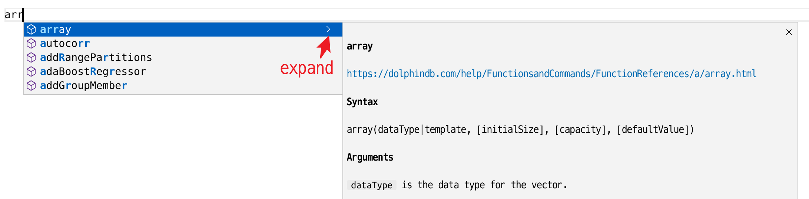

# DolphinDB VSCode Extension

<p align='center'>
    
</p>

<p align='center'>
    <a href='https://marketplace.visualstudio.com/items?itemName=dolphindb.dolphindb-vscode' target='_blank'>
        
    </a>
    <a href='https://marketplace.visualstudio.com/items?itemName=dolphindb.dolphindb-vscode' target='_blank'>
        
    </a>
    <a href='https://github.com/dolphindb/api-javascript' target='_blank'>
        
    </a>
</p>

## English | [中文](./README.zh.md)

Microsoft Visual Studio Code (VS Code) is a powerful and lightweight code editor with a rich extensibility model. VS Code extensions let you add languages, debuggers, and tools to your installation to support your development workflow.

Install the DolphinDB Extension for VS Code to add the DolphinDB scripting language in VS Code, which enables you to write and execute scripts in VS Code to operate the DolphinDB database and access its data.

## Features
- Code highlighting
- Code completion for keywords, constants, built-in functions
- Documentation and parameter hints for built-in functions
- Displays code execution results and `print()` output in the integrated terminal
- Displays running script status in bottom status bar with option to click to cancel
- Displays data structures like tables, vectors, matrices in browser pop-up windows
- Displays connections, databases and session variables in the sidebar
- Displays tables, vectors, and matrices in browser pop-up windows 
- Exports DolphinDB tables to disk (.csv file)


## Getting Started
#### 1. Install or upgrade VS Code to the latest version (above v1.68.0)
https://code.visualstudio.com/


#### 2. Install extension
Search for "dolphindb" in the VS Code **Extensions** view and click **Install**.

If the installation fails due to network reasons, open [Visual Studio Markstplace](https://marketplace.visualstudio.com/items?itemName=dolphindb.dolphindb-vscode) in your browser, click the **Version History** tab, download the latest version of the extension (with the suffix `.vsix`) to your local computer and drag and drop it to the Extensions view in VS Code.

Note: After the installation is complete, quit all windows in the VS Code and restart the program for the installation to take effect. Otherwise you may not be able to view the variables in the browser (see below).


#### 3. View and configure server connections
After installing the DolphinDB extension, an icon will be added to the Activity Bar in the VS Code. Click the icon, the DolphinDB sidebar will be displayed with three views including CONNECTIONS, DATABASES, and VARIABLES.


##### Edit connections
Click `File > Preferences > Settings` in the menu bar to open the VS Code settings.
Enter "dolphindb" in the search box, click `edit in settings.json`  to open the `dolphindb.connections` configuration item in the `settings.json` configuration file.

The `dolphindb.connections` configuration item is an array of objects where each object (wrapped by curly brackets "{ }") represents a connection. You can add or modify the connection objects to create or edit session connections as appropriate. `name` and `url` are required atrributes, and different connection objects must have different `name`. When connecting to a DolphinDB server, by default you'll be logged in as the DolphinDB admin ("autologin": true).

Hover over an attribute to view its description.


#### 4. Open or create a DolphinDB script file
- If the script file name is suffixed with `.dos` (short for DolphinDB Script), the extension will automatically recognize the DolphinDB language and enable syntax highlighting, code completion and prompts.
- If the script file is not a `.dos` file and has a different suffix, such as `.txt`, please manually associate the DolphinDB language by following the steps below:

Click the **Select Language Mode** button in the lower right corner of the VS Code editor (see screenshot below): 

Enter "dolphindb" in the language selection pop-up box and press `Enter` to associate the current file with the DolphinDB language:


#### 5. Press the shortcut key `Ctrl + E` to execute the code
In the opened DolphinDB script file, use the shortcut command `Ctrl` + `E` to send the code to the DolphinDB server for execution. When the code is executed for the first time, it will automatically connect to the selected connection listed under the DOLPHINDB tab.

- Only selected code in the script will be sent to the server for execution.
- If no code is selected, the line where the current cursor is located will be sent to the server for execution.

After the code is executed, there will be text-based output in the terminal below the VS Code editor. If the last statement of the executed code returns a table, array, or matrix, it will automatically switch to the DolphinDB area of the panel below the VS Code editor. Forms to display data structures such as tables, vectors, and matrices. It is recommended to drag the contents of the DolphinDB tab to the right side of the terminal, as shown in the figure below


##### FAQ

- If there is no response to the `Ctrl + E` shortcut key, it may be that the DolphinDB language is not associated (syntax highlighting does not take effect at this time), or the shortcut key conflicts with other plugins, and you need to customize the shortcut key:
Go to `File > Preferences > Keyboard Shortcuts` (`File > Preferences > Keyboard Shortcuts`) of VSCode to modify, enter `ctrl+e` in the search box, and delete other plug-ins that conflict with `DolphinDB: Execute Code` hot key


- If you have been stuck in execution after executing the code, open `Help` > `Switch Developer Tools (DevTools)` at the top of vscode and switch to the console tab in the pop-up window to see if there is `Webview fatal error: Error: Could not register service workers: InvalidStateError: Failed to register a ServiceWorker: The document is in an invalid state..` If there is such an error, please restart VSCode
If it still can't be solved, try the following methods to end all `Code.exe` processes and delete the service worker cache:
     - linux: `pkill code && rm -rf .config/Code/Service\ Worker/{CacheStorage,ScriptCache}`
     - windows:
         - 1. After exiting vscode, open the task manager and end all remaining vscode zombie processes `taskkill /F /IM Code.exe`
         - 2. Open `C:/Users/your username/AppData/Roaming/Code/Service Worker/` in the file manager
         - 3. Delete `CacheStorage` and `ScriptCache` two folders
    
     Reference https://github.com/microsoft/vscode/issues/125993

- If there is no automatic switch to the DolphinDB view at the bottom after executing the code and returning to the form, you need to reset the position of the DolphinDB view, as shown in the figure below


- If the dataview (data view) panel is right-clicked and hidden, it cannot be displayed again, and the execution script has been stuck in execution. You need to execute the `defs()` function, then press `ctrl + shift + p` to call out the command panel, search for open view, click to open the view, and then search for the data view (English name is dataview), click to open

- VS Code has a memory limit of about `1 GB`. It is recommended to use `limit` to limit the number of returned records; or assign the result to a variable, such as `a = select * from`, and then click the button next to the variable in the sidebar to perform paging lazy loading and retrieve single page data on demand

- In order to display tables and other data in the browser, each VSCode window will start a local HTTP server, and its available port range can be configured through `dolphindb.ports`, the default is `8321-8420`, hover the mouse over ports to view Detailed explanation. The function displayed in the pop-up window in the browser requires a version of the past two years, such as Chrome 100+ or Edge 100+ or Firefox 100+

#### 6. Switch connections and inspect session variables in the EXPLORER view > DOLPHINDB tab

After executing the code, you can perform the following actions (see screenshot below):

- Switch the connection used to execute the code (the original connection will not be disconnected)
- Click the "Disconnect" icon to the right of the connection to manually disconnect from server
- View the value of a session variable
- Use the 2 icons dispalyed to the right of each variable (excluding scalars or pairs):

    - Click the icon on the left to view the variables in the DolphinDB area of the lower panel of the editor
    - Click the icon on the right to directly open a browser pop-up window and view the variables in the pop-up window (you need to configure the browser to allow the pop-up window, see later). The popup function requires an open `DolphinDB Data Browser` tab in the browser (the URL may be http://localhost:8321/). If this tab is missing, the plugin will automatically open this page first.


##### Note: To use the "Inspect Variable" icon, configure your browser to allow pop-ups.
Preview unavailable  


#### 7. Expand function documentation
When entering a DolphinDB built-in function in the VS Code editor, suggestions and the documentation for the function will pop up as you type. Click the arrow icon ("Read More") next to the function prompt to dispaly/hide the documentation.



You can also hover the mouse over a the name of a built-in function in your code to view its documentation. The accompanying documentation for the function will expand to the side.

#### 8. Debugging
The DolphinDB extension for VS Code provides debugging support for user scripts, which allows real-time tracing of script execution, displaying of intermediate variable values and showing function call stack information. For details, see [Debugging DolphinDB Scripts with DolphinDB Extension for Visual Studio Code](./README.debug.md) 


#### 9. File upload and export
DolphinDB's VS Code extension supports users to upload files. Users are supported to upload files in the following two ways:

1. Select the file to be uploaded in the explorer of VS Code and right-click, and select "DolphinDB: Upload to Server" in the right-click menu
2. After opening the file to be uploaded, click the upload button in the upper right corner of the VS Code interface

After that, the user needs to input the path of the file uploaded to the server (cannot be empty), press Enter, and wait for the prompt "The file was uploaded successfully".

DolphinDB's VS Code extension also supports users to export files. It requires the server version to be 2.00.11 or higher. Users can export tables with the following steps:
1. Execute scripts and display the table in the panel.
2. Click on the export icon in the top-left corner.
3. A file explorer window will open, prompting you to choose the desired directory and enter a filename for the exported file. 
4. Click “Save” to export the file to the specified location. Upon successful export, a notification message will appear in the bottom-right corner.

In addition, users can customize the mapping relationship between the local path and the server path by configuring the mappings property of dolphindb.connections, so that the plug-in can map the server path according to the mappings in the subsequent file upload process. In the VS Code setting interface, select DolphinDB under extension, open the setting.json file, add or modify mappings in the connection that needs to be configured, the "key" on the left is the local address, and the "value" on the right is the server address.


After adding, the plugin will map the path according to the mappings configured by the user in the current connection. For example, the mappings configured in the user's current connection are:
```json
{
    "/path/to/local/": "/path/at/remote/",
    "/path/to/local/dir1/": "/data/server/dir1/",
    "D:/path/to/local/": "/data/server/",
    "default": "/data/server/"
}
```
When users upload files, the path mapping rules are as follows:
1. Mapping is performed in an automatic manner. The key represents the local path, and the value represents the server path. After the configuration is complete, the longest matching item will be selected as the upload path. For example, the file path uploaded by the user is `/path/to/local/dir1/file.dos`, and `/path/to/local/` and `/path/to/local/dir1/` exist at the same time to match the user path, but the longest matching item `/path/to/local/dir1/` will be matched first
2. The defalut field can be configured as a default match. If the current path does not match other items in dolphindb.mappings, the server path corresponding to the default will be used as the upload path. For example, the file path uploaded by the user is `/user/dosuments/file.dos`. At this time, if the rest of the mappings cannot be matched, the server path mapped by the `default` field will be used as the upload path, that is, `/data/server/file.dos `
3. If there is no match in dolphindb.mappings, use `getHomeDir() + /uploads/ + filename` as the upload path

#### 10. Configure the function name to be bold (optional)
Add the following textmate rules to the VSCode configuration file `settings.json`
```
"editor.tokenColorCustomizations": {
     "textMateRules": [
         // function: bold
         { "scope": "entity.name.function", "settings": { "fontStyle": "bold" }},
         { "scope": "support.function", "settings": { "fontStyle": "bold" }} ,
     ]
},
```

## Development
```shell
# Install the latest version of nodejs
# https://nodejs.org/en/download/current/

# Install the pnpm package manager
corepack enable
corepack prepare pnpm@latest --activate

git clone https://github.com/dolphindb/vscode-extension.git

cd vscode-extension

# Install project dependencies
pnpm install

# copy .vscode/settings.template.json to .vscode/settings.json
cp .vscode/settings.template.json .vscode/settings.json

# Refer to scripts in package.json

# Build the development version
pnpm run dev

# Switch to the debug panel in VSCode and start the ddb.ext debugging task (you need to disable or uninstall the installed dolphindb plugin first)
```
