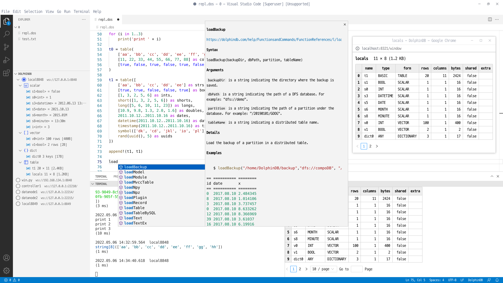

# DolphinDB VSCode Extension

<p align='center'>
    
</p>

<p align='center'>
    <a href='https://marketplace.visualstudio.com/items?itemName=dolphindb.dolphindb-vscode' target='_blank'>
        
    </a>
    <a href='https://marketplace.visualstudio.com/items?itemName=dolphindb.dolphindb-vscode' target='_blank'>
        
    </a>
    <a href='https://github.com/dolphindb/api-javascript' target='_blank'>
        
    </a>
</p>

## [English](./README.md) | 中文

VSCode 是微软开发的一款轻量、高性能又有极强扩展性的代码编辑器。它提供了强大的插件框架，开发者可以通过编写插件拓展 VSCode 编辑器的功能，甚至支持新的编程语言。

DolphinDB 公司开发了这个针对 DolphinDB 数据库的 VSCode 插件，在 VSCode 中增加了对自研的 DolphinDB 脚本语言的支持，让用户可以编写并执行脚本来操作数据库，或查看数据库中的数据。

## 功能
- 代码高亮
- 关键字、常量、内置函数的代码补全
- 内置函数的文档提示、参数提示
- 终端可以展示代码执行结果以及 print 函数输出的消息
- 在底栏中展示执行状态，点击后可取消作业
- 在底部面板中以表格的形式展示表格、向量、矩阵等数据结构
- 在侧边面板中管理多个数据库连接，展示会话变量
- 在浏览器弹窗中显示表格



## 使用说明
#### 1. 安装或升级 VSCode 到最新版 (v1.68.0 以上)
https://code.visualstudio.com/


#### 2. 安装插件
在 VSCode 插件面板中搜索 dolphindb, 点击 install

如果因为网络原因安装失败，可以前往下方的网页手动下载后缀为 `.vsix` 的插件，下载后拖到 VSCode 插件面板中  
https://marketplace.visualstudio.com/items?itemName=dolphindb.dolphindb-vscode

点击 Version History 下载最新的版本到本地

安装完插件后，请完全退出 VSCode 所有窗口并重新打开 VSCode，否则可能无法在浏览器中查看变量 (见后文)

#### 3. 查看、编辑服务器连接配置
##### 在 VSCode 编辑器左侧资源管理器 (EXPLORER) 面板的 DOLPHINDB 区域中可以查看连接
成功安装插件后，会在资源管理器 (EXPLORER) 面板中新增下方的 DOLPHINDB 连接管理区域


##### 编辑连接
点击右上角的 `settings` 按钮, 然后跳转到 `settings.json` 配置文件中编辑 `dolphindb.connections` 配置项  
`dolphindb.connections` 配置项是一个对象数组，默认有四个连接配置，可按情况修改或增加连接对象，
`name` 和 `url` 属性是必填的 (不同的连接对象必须有不同的 `name`), 默认自动登录 admin 账号 ("autologin": true)  
将鼠标移动到属性上可以查看对应属性的说明  


#### 4. 打开或新建一个 DolphinDB 脚本文件
- 如果脚本文件名是 `.dos` 后缀 (DolphinDB Script 的缩写)，插件会自动识别为 DolphinDB 语言，自动启用语法高亮及代码补全、提示
- 如果脚本文件名不是 `.dos` 后缀, 比如 `.txt` 后缀，则需要手动关联 DolphinDB 语言，方法如下：

点击 VSCode 编辑器右下角状态栏的语言选择按钮，如下图  


在语言选择弹框中输入 `dolphindb`, 回车，即可切换当前文件关联的语言为 DolphinDB 语言  


#### 5. 按快捷键 `Ctrl + E` 执行代码
在打开的 DolphinDB 脚本文件中，可以按快捷键 `Ctrl + E` 将代码发送到 DolphinDB Server 执行，第一次执行代码时会自动连接到 DOLPHINDB 区域中选中的连接
- 如果当前有选中的代码，会将选中的代码发送至 DolphinDB Server 执行
- 如果当前无选中的代码，会将当前光标所在的行发送至 DolphinDB Server 执行

执行代码后，VSCode 编辑器下方的终端内会有基于文本的输出，如果执行的代码最后一条语句返回了表格、数组、矩阵，则会自动切换到 VSCode 编辑器下方面板的 DolphinDB 区域中以表格的形式展示表格、向量、矩阵等数据结构。建议将 DolphinDB 标签页的内容拖动到终端的右侧，如下图


##### 常见问题

- 如果出现 `Webview fatal error: Error: Could not register service workers: InvalidStateError: Failed to register a ServiceWorker: The document is in an invalid state..` 这样的错误，请重启 VSCode

- 如果出现执行代码并返回表格后，底部没有自动切换到 DolphinDB 视图的情况，需要重置 DolphinDB 视图的位置，如下图所示  


- 如果出现 `Ctrl + E` 快捷键无反应，可能是未关联 DolphinDB 语言（此时语法高亮也未生效），或者快捷键与其他插件冲突了，需要自定义快捷键:  
到 VSCode 的 `文件 > 首选项 > 键盘快捷方式` (`File > Preferences > Keyboard Shortcuts`) 中修改，在搜索框中输入 `ctrl+e`, 删除和 `DolphinDB: 执行代码` 冲突的其他插件的快捷键


- VSCode 有大约为 `1 GB` 的内存限制。建议使用 `limit` 限制返回记录数；或者将结果赋给某个变量，如 `a = select * from`，后续通过点击侧边栏变量旁边的按钮进行分页懒加载，按需取回单页数据

- 为了在浏览器中展示表格等数据，每个 VSCode 窗口会启动一个本地 HTTP 服务器，其可用端口范围可以通过 `dolphindb.ports` 配置，默认为 `8321-8420`，鼠标悬浮在 ports 上可查看详细解释。在浏览器中弹窗展示的功能，要求近两年的版本，如 Chrome 100+ 或 Edge 100+ 或 Firefox 100+

#### 6. 在 DOLPHINDB 区域中切换连接及查看已连接会话的变量
执行代码后，如下图所示，可以：
- 切换执行代码所用的连接 (原有连接不会断开)
- 点击连接右侧的按钮手动断开连接
- 查看会话变量的值
- 非 scalar, pair 类型的变量右侧有两个图标
    - 点击左边的图标可以在编辑器下方面板的 DolphinDB 区域中查看变量
    - 点击右边的图标可以直接打开一个浏览器弹窗，在弹窗中查看变量 (需要配置浏览器允许弹窗, 见后文)。弹窗功能需要浏览器中有一个打开的 `DolphinDB Data Browser` 标签页 (URL 可能是 http://localhost:8321/)，如果缺少这个标签页插件会先自动打开这个页面


##### 请配置浏览器允许该网站弹窗显示


#### 7. 展开函数文档
在 VSCode 编辑器中输入 DolphinDB 内置函数时，点击函数右侧的箭头可以展开函数的文档


函数输入完成后，将鼠标悬浮于函数名称上，也可查看函数文档

#### 8. 调试脚本
DolphinDB 的 VSCode 插件提供针对用户脚本的调试功能，该功能满足实时追踪运行脚本、显示中间变量的值以及展示函数调用栈信息的用户需求，以利于用户写出更快更好的脚本。具体调试方法请参考

[调试功能文档](./README.debug.zh.md)

## 开发说明
```shell
# 安装最新版的 nodejs
# https://nodejs.org/en/download/current/

# 安装 pnpm 包管理器
corepack enable
corepack prepare pnpm@latest --activate

git clone https://github.com/dolphindb/vscode-extension.git

cd vscode-extension

# 安装项目依赖
pnpm install

# 将 .vscode/settings.template.json 复制为 .vscode/settings.json
cp .vscode/settings.template.json .vscode/settings.json

# 参考 package.json 中的 scripts

# 构建开发版本
pnpm run dev

# 在 VSCode 中切换到调试面板，启动 ddb.ext 调试任务（需要先禁用或卸载已安装的 dolphindb 插件）
```
