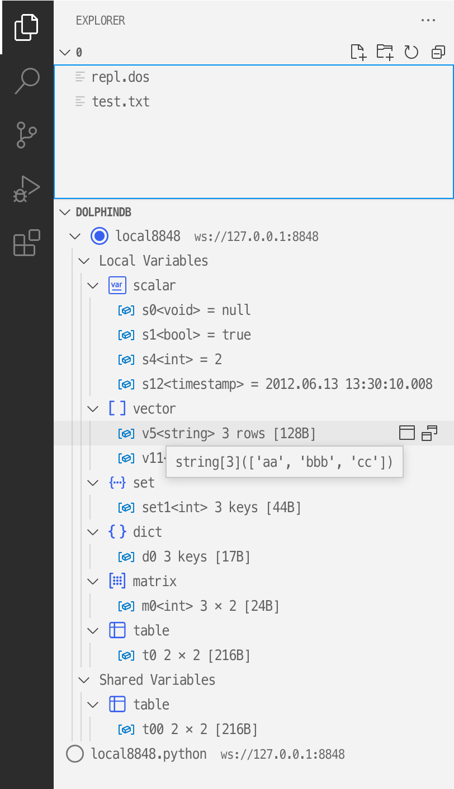

# DolphinDB VSCode Extension

    

    
    

## [English](./README.md) | 中文

## 使用说明
#### 1. 升级 VSCode 到最新版 (v1.66.0 以上)
https://code.visualstudio.com/

#### 2. 安装插件
在 VSCode 插件面板中搜索 dolphindb, 点击 install

如果因为网络原因安装失败，可以前往下方的网页手动下载后缀为 `.vsix` 的插件，下载后拖到 VSCode 插件面板中  
https://marketplace.visualstudio.com/items?itemName=dolphindb.dolphindb-vscode

点击 Version History 下载最新的版本到本地

安装完插件后，请完全退出 VSCode 所有窗口并重新打开 VSCode，否则可能无法在浏览器中查看变量 (见后文)

#### 3. 编辑服务器连接配置
点击菜单栏中的 `文件 > 首选项 > 设置` (`File > Preferences > Settings`) 或者按快捷键 `ctrl + 逗号` 打开 VSCode 设置  
在搜索框中输入 dolphindb, 点击下方的 `在 settings.json 中编辑`, 在跳转到的 `settings.json` 配置文件中编辑 `dolphindb.connections` 配置项  
`dolphindb.connections` 配置项是一个对象数组，默认有四个连接配置，可按情况修改或增加连接对象，
`name` 和 `url` 属性是必填的 (不同的连接对象必须有不同的 `name`), 默认自动登录 admin 账号  
将鼠标移动到属性上可以查看对应属性的说明  

#### 4. 打开或新建一个 DolphinDB 脚本文件
- 如果脚本文件名是 `.dos` 后缀，插件会自动识别为 DolphinDB 语言，自动启用语法高亮及代码补全、提示
- 如果脚本文件名是 `.txt` 后缀，则需要手动关联 DolphinDB 语言，方法如下：

点击 VSCode 编辑器右下角状态栏的语言选择按钮，如下图  

在语言选择弹框中输入 `dolphindb`, 回车，即可切换当前文件关联的语言为 DolphinDB 语言  

#### 5. 按快捷键 `ctrl + e` 执行代码
- 如果当前有选中的代码，会将选中的代码发送至 DolphinDB Server 执行
- 如果当前无选中的代码，会将当前光标所在的行发送至 DolphinDB Server 执行

(如需自定义快捷键也可以到 VSCode 的 `文件 > 首选项 > 键盘快捷方式` (`File > Preferences > Keyboard Shortcuts`) 中修改，输入 dolphindb, 找到 execute 后，双击，输入你想要的快捷键)

执行代码后会自动在浏览器中打开页面并展示执行结果 (http://localhost:8321/)  
VSCode 编辑器下方的 Terminal 中也会有基于文本的输出

如果报错连接不上服务器，请检查:
- DolphinDB Server 版本不能低于 `1.30.16` 或 `2.00.4`
- 是否开了系统代理，有些代理不支持 WebSocket 连接，请在系统中关闭，或者排除对应 IP，然后重启 VSCode)

#### 6. 在 VSCode 编辑器左侧 EXPLORER 面板的 DOLPHINDB 区域中切换连接及查看连接的会话变量
如下图所示，有以下功能：
- 切换执行代码所用的连接 (原有连接不会断开)
- 点击连接右侧的按钮手动断开连接
- 查看会话变量的值
- 非 scalar, pair 类型的变量右侧有两个图标
    - 点击左边的图标可以在浏览器页面 http://localhost:8321/ 中查看变量
    - 点击右边的图标可以直接打开一个浏览器弹窗，在弹窗中查看变量 (需要配置浏览器允许弹窗, 见后文)

##### 请配置浏览器允许该网站弹窗显示  

#### 7. 展开函数文档
点击函数右侧的箭头可以展开函数的文档

